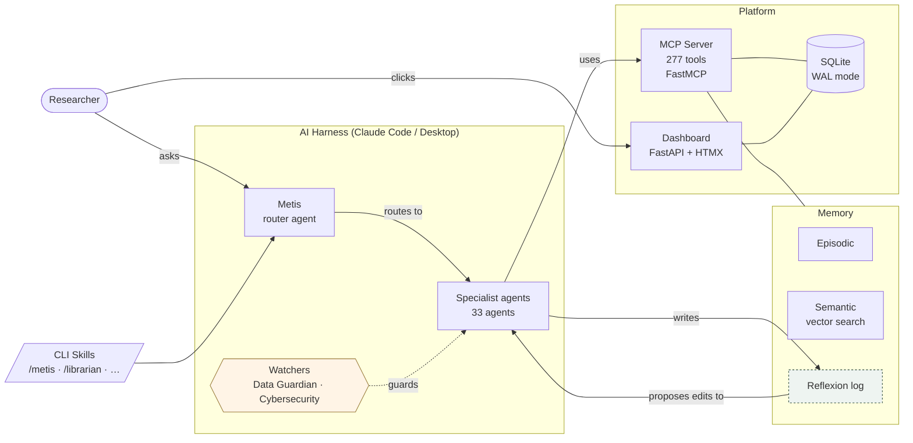

<p align="center">
  <picture>
    <source media="(prefers-color-scheme: dark)" srcset="Metis_github.png"/>
    
  </picture>
</p>

<h1 align="center">Metis — The Research Cortex</h1>

<p align="center">
  <em>AI built around researchers. Not a prompt box — a way of working.</em><br>
  <em>Your papers, meetings, ideas, notes and journal — each one linked to the rest.</em><br>
  <em>A research companion that reviews its own work and gets sharper every week.</em>
</p>

<p align="center">
<em>It's 7:20. You open the dashboard. The morning brief reads:</em>
<br><br>
<strong><em>"Three papers matching your configured topics landed overnight — one directly challenges a working hypothesis in your field. Your literature coverage in methods has grown to 84%. I've cross-referenced all three with your knowledge graph, connected them to your meeting note from Tuesday, and flagged four passages for your review. One tracked analysis is approaching a key deadline."</em></strong>
<br><br>
<em>No prompt. No setup. Your research, connected — every morning.</em>
</p>

<p align="center">
  🟢 <strong>Actively developed.</strong> &nbsp;Latest: plan a run of days on one row · a Work view ordered by what you actually touched · and a month of controls that rendered perfectly and did nothing, found and fixed. &nbsp;<a href="#changelog"><strong>See what's new ↓</strong></a>
</p>

<br>

<table width="100%" cellspacing="0" cellpadding="16" border="0">
<tr>
<td width="33%" valign="top" align="center">
<p><strong>☁️ Light</strong><br><em>MCP server only</em></p>
<p><em>You ask Claude to build a monitoring dashboard for your current project. Metis recalls the dashboard you built eighteen months ago, your preferred layout, and your standard indicators. The right specialist agents deliver exactly what you need — in your style, to your domain's standards — without any re-explaining.</em></p>
</td>
<td width="33%" valign="top" align="center">
<p><strong>🔗 Cross-pollination</strong><br><em>The moment everything connects</em></p>
<p><em>You capture a quick idea about a novel surveillance approach. Within seconds, Metis surfaces three things you'd forgotten existed: a methodology paper from fourteen months ago that used a similar approach, a meeting note from March where your field partner described the same barrier, and an open question you logged after a conference. You hadn't connected any of it. Metis did. The grant section writes itself.</em></p>
</td>
<td width="33%" valign="top" align="center">
<p><strong>🌐 Metis OS</strong><br><em>The full picture — in development</em></p>
<p><em>Your calendar shows a meeting with a research collaborator. Yesterday you captured an idea about a new method. Metis has your April transcript with this person and this week's new papers. A briefing appears before you leave. After the meeting, you ask for a five-day course on that topic from the latest research. By evening, it's ready.</em></p>
</td>
</tr>
</table>

<br>

<p align="center">
  <strong>Editions:</strong>&nbsp;
  <a href="https://github.com/SVerITG/Metis"><b>Metis</b> — Base shell</a>
  &nbsp;·&nbsp;
  <a href="https://github.com/SVerITG/Metis_PH"><b>Metis_PH</b> — Public Health &amp; Epidemiology</a>
  &nbsp;·&nbsp;
  <a href="https://github.com/SVerITG/Metis_BM"><b>Metis_BM</b> — Biomedical Sciences <em>(coming soon)</em></a>
  &nbsp;·&nbsp;
  <a href="https://github.com/SVerITG/Metis_CL"><b>Metis_CL</b> — Clinical Sciences <em>(coming soon)</em></a>
</p>

<p align="center">
  
  <a href="https://github.com/SVerITG/Metis_PH/stargazers"></a>
  
  <a href="https://github.com/SVerITG/Metis_PH/blob/main/LICENSE"></a>
  
  
  <a href="https://glama.ai/mcp/servers/SVerITG/Metis_PH"></a>
  
</p>

<!-- PH-ONLY:START -->
> ### 🩺 This is the Public Health & Epidemiology edition
> Metis_PH ships with a **pre-loaded public-health knowledge layer** — WHO guidance, global-health reports, and epidemiology/methods references — so you can ask grounded, cited questions on day one without building a corpus first. The domain-agnostic [**base shell** (`SVerITG/Metis`)](https://github.com/SVerITG/Metis) is identical in every other way; it ships empty and builds *your* field's knowledge layer through the setup questionnaire.
<!-- PH-ONLY:END -->
<!-- BASE-NOTE -->

---

## See it in action

<p align="center">
  <br>
  <em>The dashboard at a glance — your projects, tasks, the morning brief and what to focus on, in one calm view.</em>
</p>

<p align="center">
  <br>
  <em>A tour through Metis — the system tab and every part of your Research Cortex: today, work, knowledge, meetings, ideas, learning and the control room.</em>
</p>

<p align="center">
  <br>
  <em>The silent layer — one click on the morning brief opens Claude Desktop, primed with your work, ready to brainstorm.</em>
</p>

<p align="center">
  <br>
  <em>Metis reviews its own work and proposes its own improvements — the self-improvement loop, in plan mode.</em>
</p>

---

## Why researchers trust it

- **📚 It cites your own sources.** Knowledge answers are anchored in *your* indexed library, with document- and page-level citations — not the model's guesses. Your library grounds the answer; it doesn't fence it in. Metis still brings in recent literature, guidelines and wider knowledge where they matter, and tells you which is which — so anything worth citing that you don't have yet becomes a paper you can add.
- **🔗 It connects everything you know.** Every paper, meeting transcript, idea, note, journal entry and task is linked to the rest of your work. The grant you write today surfaces a method paper from last year and a meeting note from March — you never go looking; Metis brings it to you.
- **🧠 It routes to the right expert.** Ask in plain language, and Metis hands the work to the right one of 30+ specialist skills — Librarian, Methods Coach, Writing Partner, Meeting Memory, Epidemiologist, Course Builder, and more.
- **🔁 It improves itself.** After every task it logs what worked and what fell short; each week it drafts improvements to its own behaviour and waits for your approval. Most MCP servers are static — Metis gets sharper the longer you use it.
- **🚫 It refuses to invent.** Ask about something that isn't in your library and Metis tells you so, instead of fabricating a plausible-sounding answer. (This grounding behaviour is covered by an automated test.)
- **🔒 It stays on your machine.** Local embeddings, local database, local files. Your papers, patient-adjacent data, and unpublished work never leave your computer.

> 🎥 **See it in action** above — the dashboard, a tour of the tabs, the silent layer into Claude Desktop, and Metis improving its own work.

**Easiest way to try it:** install [Claude Desktop](https://claude.ai/download) and run the [3-step setup](#for-researchers) — a demo workspace is pre-loaded, so you start with something to explore instead of a blank screen.

---

## Who is this for?

<table width="100%" cellspacing="0" cellpadding="20" border="0">
<tr>
<td width="50%" valign="top" align="center">

### 🔬 I'm a researcher

No programming background needed. Install in minutes, start working immediately. Everything Metis does is explained in plain language.

**→ [Get started (3 steps)](#for-researchers)**

</td>
<td width="50%" valign="top" align="center">

### ⚙️ I'm a developer

Open-source, extensible, well-architected. Build domain packs, add agents, extend the MCP server, or deploy for your institution.

**→ [Explore the architecture](#for-developers)**

</td>
</tr>
</table>

---

## What is Metis?

Metis is a **research companion built on top of Claude** that keeps your data on your own machine. It gives every AI conversation a persistent memory of your domain, your papers, your projects, and your working history. It routes your requests to the right specialist, does the work, records the result, and returns a plain answer — without requiring you to prompt or configure anything.

The app runs on your machine and your data stays there — your documents, notes, embeddings and memory never leave it. The reasoning is powered by Claude, so the text you choose to send for analysis goes to the Anthropic API; everything else is local. (See [Data Protection](#data-protection) for exactly what leaves your machine, and when.)

**The short version:** imagine an AI that already knew your field and your literature, connected every paper, meeting, idea and note you've captured, sent each request to the right specialist — and got sharper about your work, *and about itself*, the longer you used it. That's Metis.

---

## How it works

Metis is **not a separate app you log into.** It's a small service that runs quietly in the background and connects Claude to your research — your papers, your memory, your projects.

1. **A background service** (the "MCP server") starts with your computer. It's the bridge between Claude and your files — you never interact with it directly.
2. **You talk to Metis through Claude**, two ways:
   - **Claude Desktop** (easiest): open it and pick a **Metis prompt** (e.g. *Metis*, *Metis Doctor*) from the prompt menu — or just ask.
   - **Claude Code** (terminal): type **`/metis`** followed by your request.
3. **You ask in plain language.** Metis works out which of its 33 specialists should handle it, does the work using *your* library and memory, and answers — citing sources.

That's it. There's nothing to learn before you start; the dashboard is optional visibility *on top* of all this.

---

## Design Philosophy

Every AI conversation starts from zero. You spend ten minutes re-explaining your context, and when the session ends, it's gone. Generic AI tools are powerful but stateless — they know everything about the world and nothing about you.

**Metis is built on one idea: the AI should know you. And it should keep getting better — on its own.**

Not just your name — your domain, your literature, your projects, your preferred working style, your open questions, your meeting notes from last month, and the paper you added to your library yesterday. The longer you use Metis, the better every response gets. Not because the AI changes — because Metis knows you better.

**You don't need to follow developments in AI.** Metis does that for you. Every week, Metis reviews its own performance across all your sessions, identifies where it could have done better, drafts improvements to its own behaviour, and waits for your approval before applying them. As better methods and models become available, those improvements are folded in the same way — always proposed for your approval, never applied behind your back. As a researcher, you focus on your research. Metis handles keeping itself sharp.

**The core mechanism is cross-pollination.** Every time you capture an idea, add a paper, record a meeting, or complete a task, Metis connects it to everything else in your research universe. A paper you indexed a year ago surfaces when you're writing a grant today. A meeting note from March links to the idea you captured this morning. An open question from six months ago connects to a new paper that just came out. These connections happen automatically, in the background, without you having to search for them. This is what makes Metis a *research companion* rather than a search tool — it thinks across your entire body of work so you don't have to hold it all in your head.

This is genuinely new ground. The individual components — local language models, retrieval-augmented generation, agent routing, vector search — all exist independently. What Metis presents is a coherent integration of all of them, purpose-built for the specific demands of research work: long timelines, sensitive data, deep literature, and knowledge that accumulates over years. A system that grows *with* you, and surfaces connections *for* you — rather than starting from zero every session. To our knowledge, nothing quite like this exists as a unified, locally-running, researcher-facing system.

### Three levels — choose your entry point

| Level | What it is | Best for |
|---|---|---|
| **☁️ MCP server only** | A background service that runs alongside Claude. Persistent memory, session awareness, 30+ specialist agents — no dashboard, no visible app. | Researchers who use Claude already and want it to know their work |
| **📊 With the dashboard** | Full visibility across your research life — papers, ideas, meetings, tasks, projects, all connected. Built for *cross-pollination* (ideas linking to literature) and *brain off-loading* (tracking leaving your head, entering the system). | Researchers who want a complete research operating environment |
| **🌐 Metis OS** | Connects to email, calendar, data systems, and institutional infrastructure — a unified intelligence layer for your entire working environment. | The longer vision. Still in development. |

> **Where things stand today:** The MCP server, 33 agents, and the 9-tab dashboard are fully operational and used daily. The one-click installer and the pre-loaded domain knowledge layer are still being refined. This is a working system — not vaporware — but it is also not finished. If something breaks, please open an issue. That feedback shapes what gets built next.

---

## For Researchers

*No programming background needed. Everything below is point-and-click or copy-paste.*

---

### How Metis is powered — you choose (you won't burn API tokens just by using it)

Metis runs two ways, and you pick:

- **On your Claude subscription** — **no API key, no per-token bills.** This is the everyday path: you talk to Metis through **Claude Desktop or Claude Code**, and the dashboard's "✦ Update with Claude" / brainstorm buttons open Claude Desktop on your subscription. Most people use Metis entirely this way.
- **With an Anthropic API key** — only needed for things that run *while you're not there*: the scheduled morning scan and automated brief generation. Pay-per-token, typically a few cents a day.
- **With a local model (Ollama)** — optional, for fully-offline helper tasks (e.g. the data assistant).

The installer asks for an API key so automation *can* run, but you can **skip it and use Metis on your subscription alone**. Nothing in the interactive experience requires the API.

---

### Install in 3 steps

> **Step 1 — (Optional) Get an Anthropic API key — only for unattended automation (free, 2 minutes)**
>
> 1. Go to **[console.anthropic.com](https://console.anthropic.com)** and create an account.
> 2. Click **API Keys → Create Key**. Copy the key (it starts with `sk-ant-…`).
> 3. Keep that tab open — the installer will ask for it once.
>
> The key stays on your computer. It is never uploaded or shared.

---

**Windows**

> **[⬇ Download MetisSetup.exe](https://github.com/SVerITG/Metis_PH/releases/latest)**

Double-click the installer. The wizard walks you through:
1. **Full or AI only** — Full gives you the AI assistant + 9-tab research dashboard (~15 min). AI only is faster (~5 min) and you can add the dashboard later.
2. **Your projects** — Tell Metis what you're working on. It creates a tracking record for each project, writes a context file into the project folder, and registers it in Claude Desktop automatically.
3. **Demo workspace** — Pre-loads realistic example projects, meetings, literature, and tasks so you can explore every feature immediately. Recommended for first-time users.
4. **API key** — Paste it once.

Everything else is automatic. Claude Desktop opens at the end with Metis ready to go.

*Requirements: Windows 10 or 11 · Internet connection · [API key](https://console.anthropic.com)*

---

**macOS or Linux**

Open Terminal and paste:

```bash
bash <(curl -fsSL https://raw.githubusercontent.com/SVerITG/Metis_PH/main/system/mcp-server/setup-mcp.sh)
```

The script asks two questions (Full or AI only, demo workspace) and does the rest. Registers Metis with Claude Desktop and Claude Code automatically. Works on Ubuntu 20/22/24, Debian, and macOS.

> **Requirements:** Python **3.10–3.13**. The installer prefers [`uv`](https://astral.sh/uv) (which downloads its own Python 3.12 — no system packages needed). If `uv` isn't available it falls back to your system Python; on a bare system you may need `sudo apt install python3-venv`. Very new Python (3.14+) isn't supported yet — some packages don't publish wheels for it. If you hit *"ensurepip is not available"*, install `uv` (the line above) or `python3-venv` and re-run.

---

### After installation — API key and updating

**API key (optional):** Copy `system/.env.example` to `system/.env` and add your key, or the installer will prompt you. The key enables automated features (morning briefs, scheduled scans); interactive use through Claude works without it.

**Updating after `git pull`:** The MCP server runs from a local copy of the source (not the repo directly). After pulling new code, re-sync with:

```bash
bash system/mcp-server/setup-mcp.sh --update
```

This re-copies the source, reinstalls the package, and applies migrations — without re-running the full wizard.

**Moved the Metis folder?** Update the marker file at `~/.local/share/metis-mcp/.metis-rc-root` with the new path, or re-run the installer.

---

### MCP client configuration

The installer registers Metis with Claude Desktop and Claude Code automatically — you normally don't need to edit any config by hand. The blocks below are for reference (and for MCP directories): they show how the `metis-rc` server is wired in.

> **Metis is not a one-line `npx`/`uvx` server.** Run the installer first — it builds the local virtual environment, initialises the database, and generates the launch script (`run.sh`) the configs below point to.

**Step 0 — install (builds the venv + DB, generates `run.sh`):**

```bash
bash system/mcp-server/setup-mcp.sh
```

**Claude Code (any OS)** — done for you by the installer, or add it manually:

```bash
claude mcp add metis-rc ~/.local/share/metis-mcp/run.sh
```

**Claude Desktop — macOS** — in `~/Library/Application Support/Claude/claude_desktop_config.json`:

```json
{
  "mcpServers": {
    "metis-rc": {
      "command": "bash",
      "args": ["/Users/<you>/.local/share/metis-mcp/run.sh"]
    }
  }
}
```

**Claude Desktop — Linux (native)** — in `~/.config/Claude/claude_desktop_config.json`:

```json
{
  "mcpServers": {
    "metis-rc": {
      "command": "bash",
      "args": ["/home/<you>/.local/share/metis-mcp/run.sh"]
    }
  }
}
```

**Claude Desktop — Windows + WSL** — in `%APPDATA%\Claude\claude_desktop_config.json`:

```json
{
  "mcpServers": {
    "metis-rc": {
      "command": "wsl",
      "args": ["-e", "/home/<you>/.local/share/metis-mcp/run.sh"]
    }
  }
}
```

> Replace `<you>` with your username. The generated `run.sh` resolves `METIS_RC_ROOT` from a marker file at runtime — no hardcoded paths. No API key is required to run the server itself.

---

### What you get on day one

| Feature | What it does |
|---|---|
| **30+ specialist agents** | Librarian, Epidemiologist, Methods Coach, Writing Partner, Meeting Memory, Course Builder, Career Coach, Critic, and more — each an expert in their domain |
| **Grounded answers** | Every knowledge question is automatically answered from your own indexed document library with page-level citations — not AI guesses |
| **Library management** | Import PDFs, sync Zotero or Mendeley, ask "what do my papers say about X?" — cited answers from your own library |
| **Morning intelligence brief** | Every morning: new papers on your exact research topics, field news, surveillance alerts, and a focus recommendation — fully personalised |
| **Live meeting assistant** | Follow along in real time, or paste a transcript — get structured notes, action items, and project cross-references automatically |
| **Project tracking** | Every project gets a tracking record, a context file in its folder, and integration with Claude Desktop. The Update button scans all your project folders for activity. |
| **Voice capture** | Record anywhere, transcribe locally (no API, no upload), route to ideas, journal, or notes |
| **9-tab dashboard** | Today · News · Knowledge · Meetings · Learning · Work · Thinking · Teach · Metis — all live, all local |
| **Data protection** | Six security layers + the `/safe-analysis` workflow. Sensitive data is detected and held back before it reaches the AI, and the recommended pattern keeps raw data on your machine entirely — you share only derived metadata. |
| **Cross-pollination** | Every idea, paper, meeting, and task is automatically connected to everything else in your research universe. Metis surfaces links across time — a paper from last year, a meeting note from March, a question you logged at a conference — without you searching for any of it. |
| **Token tracking** | Every agent run shows exactly what it cost — which specialist was used, how many tokens, what model. The dashboard Today tab has a live token pulse so you always know your daily usage. Most daily tasks stay under a few cents. |
| **Tool subset loading** | Metis registers **277** MCP tools, but exposing all of them to Claude on every session wastes context. By default, ~80 everyday tools load immediately; the rest are retrieved on demand via `find_tools()` / `load_tool_group()` (progressive disclosure). Each tool definition costs tokens; loading fewer means more room for actual work and lower per-session cost. Disable with `METIS_TOOL_SEARCH=0` to load all tools. |
| **Metis evolves — you don't have to** | Every week, Metis reviews its own session logs, identifies where it underperformed, and drafts behaviour improvements. You approve or reject them — nothing changes without your sign-off. New capabilities are folded in the same way. You focus on your research; Metis keeps itself sharp. |
| **Grows with you** | Every agent run adds to your profile. A question asked after six months of use gets a meaningfully better answer than the same question on day one — not because the AI changed, but because Metis knows you better. |

---

### Key Workflows

---

**Morning**

```
Wake up
  └─ Metis scanned overnight
       ├─ New papers on your configured research topics
       ├─ Surveillance alerts and field news
       ├─ Tasks due today, overdue items
       └─ Suggested daily focus based on your open projects
           └─ Open dashboard → read morning brief → start work
```

---

**Literature**

```
New paper (PDF / DOI / Zotero / Mendeley import)
  └─ Librarian indexes it
       ├─ Added to knowledge graph
       ├─ Cross-pollinated with existing papers, past ideas, meeting notes
       └─ Available for cited semantic search immediately
           └─ Ask: "What do my papers say about X?"
                └─ Answered with inline citations from your own library
```

---

**Meetings**

```
Meeting ends
  ├─ Paste transcript (Teams / Zoom / any audio file)
  └─ Meeting Memory agent processes it
       ├─ Structured notes with context
       ├─ Action items: who does what, by when
       ├─ Cross-references to your projects and open questions
       └─ Follow-up tasks auto-added to Work tab
```

---

**Ideas and writing**

```
Idea surfaces
  └─ Ctrl+K → capture instantly (i: idea · n: note · t: task · q: question)
       └─ Metis cross-pollinates immediately
            └─ Related papers + past ideas surfaced automatically
                 └─ Writing Partner → draft · Librarian → sources · Methods Coach → check argument
```

---

**Teaching and courses**

```
Course topic defined
  └─ Course Builder
       ├─ Generates lessons, slides, assessments, question banks
       ├─ Flags new papers relevant to your course automatically
       ├─ Gap analysis against current literature
       └─ Spaced repetition for your own knowledge maintenance
```

---

### The Dashboard

The **9-tab dashboard** runs on your own machine at `http://127.0.0.1:8080` — no hosted service, no third-party account, and your papers, notes and database stay on your disk. The *thinking* happens through Claude, so you bring your own Claude subscription or an API key (see [How Metis is powered](#how-metis-is-powered--you-choose-you-wont-burn-api-tokens-just-by-using-it)).


*The Today tab — morning briefing, active project, progress, news radar, and quick stats. Everything personalised to your research domain.*

---

| Tab | What it does |
|---|---|
| **Today** | Morning brief, priority task queue, news rail, quick capture (`Ctrl+K`) |
| **News** | Field news, surveillance alerts and RSS signals relevant to your work |
| **Knowledge** | Semantic PDF search, literature cards, knowledge graph, coverage gap analysis |
| **Meetings** | Live assistant, transcript import, action items, cross-references |
| **Learning** | Course progress, spaced repetition, competency map |
| **Work** | Tasks, project cards, activity tracking, one-click open in VS Code / RStudio / Claude — with a **Board** view (week ahead · intentions · project pipeline) |
| **Thinking** | Idea capture, cross-pollination, brainstorm launcher, open questions tracker |
| **Teach** | Course Builder, literature alerts, lesson generation, student-facing content |
| **Metis** | Agent run history, self-improvement proposals, system health, identity card |

---

### How Metis Knows You

When you first install Metis, a **setup wizard** walks you through your profile:

> research domain · specific interests · active projects · working style · tools you use · data sensitivity level

This creates your **identity card** — a living profile that every agent reads before responding to you. It grows over time. Every session adds context. Every idea you capture tells Metis what you're thinking about.

> A question asked after six months of use gets a meaningfully better answer than the same question on day one — not because the AI changed, but because Metis knows you better.

---

### Data Protection

**Researchers handle sensitive data. Most AI tools don't take that seriously.**

Patient data, embargoed results, unpublished findings — these should never leave your machine. Metis was designed with this in mind from the start.

**What leaves your machine (and when):**

| Service | What | When | Optional? |
|---|---|---|---|
| **Anthropic Claude API** | Text you send for analysis | On demand | Required for AI |
| **PubMed / OpenAlex** | Your research search keywords | Daily morning scan | Yes |
| **Zotero** | Library metadata (titles, abstracts, tags) | Daily sync | Yes |
| **CrossRef** | DOI queries | On demand | Yes |
| **HuggingFace** | Model name only — downloads embedding models | First run | Yes |

Everything else — your documents, voice recordings, PDF text, meeting notes, patient-adjacent data — stays on disk.

**Security layers:**

| Layer | What it does |
|---|---|
| **Pre-tool hook** | Checks every tool call for injection attempts and restricted paths; peeks at a data file's header *locally* before it's read and asks you to confirm before individual-level data is loaded into the conversation |
| **PII detection** | 11 checks, 4-level classification. Sensitive data is classified and refused at pipeline entry |
| **Injection probe** | Detects prompt injection in external content (papers, transcripts) |
| **Constitution** | 14 machine-readable rules applied to every deep agent run |
| **Red lines** | 5 non-overridable rules enforced at code level — no override possible |
| **AES-256 encryption** | All backups encrypted at rest |

**The recommended pattern for sensitive data: send code, not data.**

The strongest protection isn't a scanner — it's never putting the raw data in a prompt at all. Metis is built for this. Ask it for an analysis script (R or Python); **you run it on your own machine** against your real data; and only the *derived outputs* — variable names, value counts, summary tables, model coefficients, a data dictionary — come back to Metis. Claude reasons over the **shape** of your data, never the records.

```
Your real dataset (patient rows)         ── stays on your machine, never sent ──┐
        │ you run Metis's R/Python script locally                               │
        ▼                                                                       │
Derived metadata (column names, unique values, Table 1, model summary) ── safe to share ──► Metis
        │                                                                       │
        ▼                                                                       │
Metis builds the dashboard / writes the methods / interprets the model ◄────────┘
```

This is exactly how the dashboards and analyses in our own work were built: the raw surveillance data never left the machine, yet Metis could profile it, name every variable, list unique values, and generate a full dashboard.

**Just run `/safe-analysis`** (Claude Code or Claude Desktop) and Metis walks you through it end-to-end — it proposes the local script, tells you exactly which metadata to paste back, and never asks for raw rows. Two backstops sit underneath: the **pre-tool hook** peeks at a data file's header *locally* and asks before any individual-level data is read into the conversation, and the **Data Guardian** (PII scan + 4-level classification at pipeline entry) catches sensitive content that slips into a prompt anyway. With the pattern above, neither usually has to fire.

---

### How Metis Stays Current — So You Don't Have To

AI is moving fast. New models, new capabilities, new research tools appear every month. Most researchers don't have time to follow it. **Metis is designed to handle this for you.**

After every agent run, Metis logs a reflexion — what went well, what fell short, what context was missing. Every week it aggregates these into themes. Every week it drafts behaviour improvements with a clear rationale. You review the proposals in the Metis tab — one click to approve, reject, or edit — and the approved changes are written to disk.

This means Metis gets better at working *with you specifically*, week after week. It also means that as new AI developments become available and get integrated into Metis, you receive the improvements without having to do anything. **Your job is your research. Metis's job is to stay sharp.**

The self-improvement loop in detail:
1. **After every agent run** — reflexion logged: what went well, what could improve, what was missing
2. **Weekly** — themes extracted across all sessions; patterns identified
3. **Proposal drafted** — a concrete proposed change to agent behaviour, with reasoning
4. **You review** in the Metis tab — approve, reject, or edit before anything applies
5. **Applied with backup** — the update is written with a timestamped rollback point

No change to Metis's behaviour ever happens without your explicit approval. The system proposes; you decide.

---

## For Developers

*This section assumes familiarity with Python, Git, and the command line.*

---

### Architecture



---

### Stack

| Layer | Technology |
|---|---|
| AI harness | Claude Code, Claude Desktop (primary); Gemini (experimental) |
| MCP server | Python 3.10+, FastMCP, runs in local venv |
| Dashboard | FastAPI + HTMX + Jinja2 — no JavaScript framework |
| Database | SQLite WAL mode, 65 tables |
| Vector memory | sqlite-vec + nomic-embed-text-v1.5-Q (768 dims, local ONNX) |
| Semantic PDF search | sqlite-vec — local PDF chunk index, no external API |
| Host OS | Windows + WSL2 (Ubuntu 20/22/24) · macOS · Linux |

---

### Memory — 5 layers

| Layer | What it stores |
|---|---|
| Episodic | Session events and observations (discovery · decision · implementation · issue) |
| Semantic | Vector-indexed content (sqlite-vec + nomic-embed-text-v1.5-Q, 768 dims) |
| Procedural | Skill files and agent contracts — the agent's persistent behaviour |
| Working | Active session context and current project focus |
| Reflexive | Reflexion log and improvement proposals |

---

### Knowledge Layer & Grounded Answers (RAG)

When you ask a knowledge-intensive question, Metis retrieves relevant passages from your indexed document library *before* the specialist agent answers. The agent grounds its response in what it can read from your library — not only what it was trained to recall.

```
You ask Methods Coach:
"Which variance estimator should I use for my Poisson MLM with overdispersion?"

Metis retrieves before routing:
  → Leyland (2020) Multilevel Modelling for Public Health, p.142 — score 0.87
  → Bates lme4 vignette, p.28 — score 0.71

Methods Coach answers grounded in those passages, citing both sources.
```

| Component | Details |
|---|---|
| Embedding model | `nomic-embed-text-v1.5-Q` — 768-dim, ONNX, fully local |
| Vector store | `sqlite-vec` virtual table inside Metis SQLite database |
| Chunking | 3,200-character chunks, 400-character overlap |
| Score threshold | Chunks below 0.4 similarity dropped before injection |

**Build your field's knowledge layer.** On first setup, the wizard's research-background questionnaire briefs the **Background Maker**, which harvests, scrubs, and indexes your discipline's literature into the local RAG store — so every agent answers from *your* corpus, cited. Grow it anytime with `/background build <topic>`.

<!-- PH-ONLY:START -->
**Pre-loaded knowledge layers (this edition):**

| Layer | Documents | Covers |
|---|---|---|
| **Public Health Background** | 34 | WHO guidelines, global health reports, social determinants, NCDs, maternal & child health |
| **Epidemiology & Methods** | 10 | STROBE, WHO Basic Epi, Leyland MLM, Bates lme4, PRISMA 2020, SaTScan, CIFOR |
<!-- PH-ONLY:END -->

---

### Security Layers (detail)

1. `pre-tool-use.mjs` — 13 injection patterns, domain allowlist, path restrictions (every tool call)
2. `guardrails.py` — injection probe on all external content (papers, web, transcripts)
3. `safety.py` — 11 PII checks, 4-level classification, sensitive data refused at pipeline entry
4. `constitution.md` — 14 machine-readable rules for deep and chained agent runs
5. `red-lines.md` — 5 non-overridable rules enforced at code level

---

### Token Efficiency

- **Model routing** — Haiku for triage/summaries, Sonnet for most work, Opus only for deep reasoning; most daily usage never touches Opus
- **Surgical context assembly** — each agent gets only the context relevant to its task, not full history
- **Max-turns guardrail** — stops at 20 turns, prompts `/clear`
- **Session handoff** — under 3 KB state capture at session end; no re-paying for context already established
- **Token pulse widget** — real-time usage visible in the dashboard

---

### Cross-AI Support

| Harness | Status |
|---|---|
| Claude Code | ✅ Primary — full MCP + skills + hooks |
| Claude Desktop | ✅ Primary — full MCP + memory; no CLI skills |
| Gemini 2.0+ | 🔬 Experimental |
| OpenAI / Cursor | 🟡 Partial — MCP tools only |

---

### Installation Options

---

**Option 1 — Single command (Linux, macOS, WSL)**

```bash
bash <(curl -fsSL https://raw.githubusercontent.com/SVerITG/Metis_PH/main/system/mcp-server/setup-mcp.sh)
```

Detects Ubuntu 20/22/24, Debian, macOS Homebrew. Creates venv, installs all dependencies, registers with Claude Code and Claude Desktop. Idempotent — safe to re-run.

```bash
# Profile overrides (skip the interactive menu):
METIS_PROFILE=light    bash <(curl -fsSL ...)   # MCP server only (~5 min)
METIS_PROFILE=standard bash <(curl -fsSL ...)   # MCP + dashboard (~15 min)
METIS_PROFILE=full     bash <(curl -fsSL ...)   # Standard + scheduler (~25 min)
```

---

**Option 2 — Clone and install (any platform)**

```bash
git clone https://github.com/SVerITG/Metis_PH.git
cd Metis_PH/system/mcp-server
bash setup-mcp.sh
```

---

**Option 3 — Manual**

```bash
git clone https://github.com/SVerITG/Metis_PH.git
cd Metis_PH/system/mcp-server
python3 -m venv .venv && source .venv/bin/activate
pip install -e "."

export METIS_RC_ROOT="$(pwd)/../.."
export ANTHROPIC_API_KEY="sk-ant-..."

python -m metis_mcp.server          # MCP server
cd ../app-py && bash run.sh         # Dashboard → http://127.0.0.1:8080
```

---

**Option 4 — Docker (platform test matrix)**

```bash
# Full platform test — Ubuntu 24/22 + Debian in parallel
docker compose -f system/install/docker/docker-compose.test.yml up --build

# Production stack
docker compose -f system/install/docker/docker-compose.yml up -d
```

---

**Register with Claude Code**

`~/.claude/settings.json`:
```json
{
  "mcpServers": {
    "metis-rc": {
      "command": "/home/<username>/.local/share/metis-mcp/run.sh"
    }
  }
}
```

**Register with Claude Desktop (Windows + WSL)**

`%APPDATA%\Claude\claude_desktop_config.json`:
```json
{
  "mcpServers": {
    "metis-rc": {
      "command": "wsl.exe",
      "args": ["-e", "bash", "/home/<username>/.local/share/metis-mcp/run.sh"]
    }
  }
}
```

---

### Configuration

| File | Controls |
|---|---|
| `system/config/user-config.yaml` | Domain, interests, style — generated by setup wizard |
| `system/config/constitution.md` | 14 rules applied to every deep/chain run |
| `system/config/red-lines.md` | 5 non-overridable rules |
| `system/config/token-guardrails.md` | Model routing, handoff thresholds |
| `agents/<name>/skill.md` | Behavioural contract per agent — directly editable |
| `.claude/hooks/pre-tool-use.mjs` | Security gate on all tool calls |

---

### Dependencies

| Package | Purpose |
|---|---|
| `mcp`, `fastmcp` | MCP protocol |
| `fastapi`, `uvicorn`, `starlette` | Dashboard |
| `sqlite-vec` | Local vector search |
| `onnxruntime`, `tokenizers` | Local embeddings (no API) |
| `feedparser` | RSS feed parsing |
| `pyyaml` | User config |
| `httpx` | Async HTTP |
| `pandas`, `openpyxl`, `pyreadstat` | Data analyst tools |
| `cryptography` | AES-256-GCM backup encryption |
| `pyzotero` | Zotero sync |
| `bibtexparser` | Mendeley BibTeX import |
| `anthropic` | Claude API |

---

## Editions and Roadmap

Metis ships in distinct editions — a domain-agnostic base shell, and domain packs that add field-specific content on top.

| Repository | Status | What it is |
|---|---|---|
| **[Metis](https://github.com/SVerITG/Metis)** | ✅ Live (v1.0) | Domain-agnostic base shell. Full architecture, no domain content. Clone this to build your own edition. |
| **[Metis_PH](https://github.com/SVerITG/Metis_PH)** | ✅ Live (v1.0, this repo) | Public Health & Epidemiology — MCP server, 33 agents, dashboard, knowledge layer |
| **[Metis_BM](https://github.com/SVerITG/Metis_BM)** | 🧬 Planned | Biomedical Sciences |
| **[Metis_CL](https://github.com/SVerITG/Metis_CL)** | 🏥 Planned | Clinical Sciences |
| **Metis [Community]** | 🌍 Open | Domain packs for other research fields — contributions welcome |
| **Metis Institute Edition** | 🏛 Future | Multi-user, shared knowledge base, institutional deployment |

**What's in each domain edition:** pre-configured journals + RSS feeds · specialist agents · domain ontology · curated background knowledge library

> **Want to build a domain pack?** Fork `Metis`, add your field's knowledge library, agents, and RSS feeds, and open a PR.

### Course Packages

Standalone course packages you can drop into any Metis installation:

| Package | What it covers |
|---|---|
| **Sampling Strategies** | Probability and non-probability sampling, sample size, complex survey designs, weighted estimation |
| **Spatial Epidemiology** | Spatial autocorrelation, kernel density, SaTScan, LISA, disease mapping in R and GeoDa |
| **Genomic Surveillance** ✅ *shipped* | Pathogen sequencing in public health, phylogenetics, WGS pipelines, Nextstrain — 22 lessons, built backwards from a flagship paper so the lessons decode something real |

Open an issue with label `course-package` to pilot or contribute.

### Development Status

| Area | Status |
|---|---|
| MCP server (277 tools) | ✅ Operational, used daily — ~80 load per session, the rest on demand |
| 33 specialist agents | ✅ Operational — each a dispatchable subagent with its own bound model |
| 9-tab dashboard | ✅ Operational, some features in active development |
| Windows .exe installer | 🔧 In refinement |
| Docker images | ✅ Test matrix working |
| Domain knowledge layer (Metis_PH) | 🔧 Actively being expanded |
| Automated daily tasks (APScheduler) | ✅ Operational — 22 scheduled jobs |
| Test suite | ✅ In place — 54 files; a deterministic floor of promise, clickthrough, orchestration and security harnesses |
| Telegram capture bot | 📋 Planned |
| Metis OS (calendar, email integration) | 🌐 Future vision |

---

## Contributing

Metis is designed to grow beyond one domain and one researcher. Contributions are welcome — especially from researchers who use it and know what's missing.

See [CONTRIBUTING.md](CONTRIBUTING.md) for detailed guidelines.

### Most Wanted

**Domain packs** — the most impactful contribution. A domain pack adds:
key journals + RSS feeds · specialist agents · a domain ontology · a curated background library

| Domain | Status |
|---|---|
| Public Health & Epidemiology | ✅ Included |
| Social Sciences | 🔬 Planned |
| Biomedical / Clinical Research | 🔬 Planned |
| Environmental Science | 🔬 Planned |
| Economics and Development | 🔬 Planned |
| Psychology and Behavioural Sciences | 🔬 Planned |
| Education Research | 🔬 Planned |
| Nursing and Allied Health | 🔬 Planned |

**Other high-impact contributions:**

- **Translations** — the wizard and skill files are English-only; translations into French, Dutch, Spanish, German would open Metis to many more researchers
- **Installer testing** — Windows `.exe` and PowerShell on managed machines, corporate environments, and varied hardware; reports of what works and what breaks are valuable
- **New agents and skills** — specialist agents for use cases not yet covered
- **Security verification** — independent review of the data-stays-local guarantees (what's kept on the machine vs. sent to the Claude API), PII detection, hook behaviour, and constitution enforcement; if you find a gap, open a private issue
- **Multi-AI support** — better Gemini and local model (Ollama) support, especially for offline research environments
- **Bug reports and UX feedback** — if something doesn't work for your workflow, say so

---

## Changelog

> **Metis is under active development** — see the latest below. (Recent: a month spent on the gap between *rendered* and *working* — 172 controls that drew correctly and did nothing, a search that had never worked, a panel that spent money every time it was opened, and a test harness that reported the opposite of the truth.)

### September 2026

*A month spent almost entirely on the gap between **rendered** and **working**. Every item
below looked fine on screen.*

| What changed |
|---|
| **172 controls drew perfectly and did nothing** — `{{ x \| tojson }}` placed inside a **double-quoted** HTML attribute is broken markup: the filter escapes `<`, `>`, `&` and `'` — deliberately *not* `"`, because it is built for single-quoted attributes — so the first argument closed the attribute and everything after it became junk. The button rendered, looked right, and could not fire. It only bites *string* values (an integer id renders bare and is harmless), which is why the same line worked on one panel and failed on another depending on the column type. Changing a project's category was impossible; mark-done and delete were dead on **every** task row. **The July entry below reported this fixed — it came back in a different disguise.** It is now detected on the *rendered page*, which is the only place it is visible: `grep -cE 'onclick="[a-zA-Z]+\([^")]*"'`. |
| **Semantic search had never worked from the dashboard** — queries were embedded with the *document* prefix and never normalised, so the ranking was noise wearing the costume of relevance. Duplicate literature records were collapsed in the same pass (3,084 rows down to 1,099 — 64% were duplicates), and 2,282 papers that had never been triaged turned out to be unreachable from any screen. |
| **Every write in the system failed for five minutes after each restart** — the news scan at boot held a single write transaction open across every feed fetch, so no write anywhere in Metis could succeed until it finished. Diagnosed from kernel lock records rather than from the symptom, which had been misread for weeks. |
| **Two of the three Work views could never be shown** — the class hiding them was `!important`, so the buttons that switched view did nothing at all. Only the default view had ever been reachable. |
| **Four rival counts of one backlog, reduced to one author** — the same number was computed in four places and they disagreed; 34 cancelled tasks were being drawn as live work. A quantity computed in several places drifts, so the fix asserts one *author*, not one answer. |
| **A panel that spent money every time you opened it** — one surface made **nine paid API calls and took 18.5 seconds on every view**, because a themed summary was computed on the render path. It measured as instant in every test, because a test process has no API key and silently fell back to word-counting. Now cached, with the model pass moved behind a control that names its cost. A page that draws a panel must not spend money or block on a network round-trip. |
| **The test harness reported the opposite of the truth** — it announced *"0 of 33 agents have ever run — routing is broken"* while its own report, four sections earlier, counted 733 runs. It was reading a database path retired three months before, and its loader degraded to an empty result instead of failing. 34 of 35 agents had in fact run. A check that cries wolf is worse than no check, so a harness now fails when its own inputs are missing. |
| **Unattended recovery never ran on battery** — the task that restarts the dashboard had been installed by a fallback path that defaults to *do not start on batteries*, with no command-line switch to change it. On a laptop that meant no supervision for most of its life, while every status field read healthy. The tell was the gap between last-run and the repetition interval, not any error. |
| **Plan a run of days on one row** — a project or a single task can be planned onto a day, and a multi-day commitment (a five-day training, a field week) is **one** entry that says which day of the run today is. A plan is an *intention*, so it never writes a deadline onto the work itself — and re-planning extends the run instead of silently ignoring you. |
| **The Work list answers what you have actually touched** — the default view is ordered by most recent work, never-opened last, instead of by a manual order nobody had ever set. Manual arrangement moved to the per-category views, where it is visible; project categories became things you can create, rename, merge and reorder; and a project's launcher row now reflects what that project can actually open. |
| **A shelf is a reason for keeping, not a topic label** — library categories gained a *kind* (purpose, tracking, attachment) that changes what the shelf does, rather than being decoration. |
| **Release hygiene, twice** — the base-shell builder published the **unstripped** edition after its own identity scrub had failed, because a shell idiom hid a fatal error; and a branch pushed directly bypassed the scrub entirely. Both are closed. Identity was also removed from the working tree and from what two public repositories had already published. |

### August 2026

| What changed |
|---|
| **Fact-checking became a mechanism instead of a convention** — a claim is now checked, not trusted. Two layers: a deterministic one (is the cited document indexed, does the page exist, do the figures and quoted strings actually appear on it, does the DOI resolve, **is the paper retracted**) and a judgement one (does the literature agree, are there qualifiers and caveats the summary dropped, has newer evidence arrived since). Conversation gets annotated; artifacts get a hard gate — `tools/verify_citations.py` exits non-zero on a document that cites a page which does not support the claim. Nothing about it is a model guessing: the checker is deliberately less fallible than the thing it checks. |
| **Every report now carries its denominator** — the coverage line ("18 of 187 citation-shaped items were checkable as written") is printed whether or not it flatters the result. A verification report that omits what it did *not* cover reads as a clean bill of health, which is worse than no report. |
| **Fact-checking beyond citations** — ask about a specificity figure and Metis weighs the *spread* of reported values across your library, surfaces the qualifiers attached to each, notes what the abstract omitted, and checks whether more recent work has moved the number. |
| **Focus areas — surfaces you add yourself** — a focus is a subject you want to stay current on ("AI in health and epidemiology"), and it composes one page out of the parts Metis already has: news, reading, your notes and ideas, and a running overview. It owns a *query*, never content — so archiving one leaves every note, idea and paper exactly where it was. Its lens is a conjunction of keyword groups (OR within, AND across), which is what stops "Can AI ever be conscious?" from landing on a health surface. The shelf holds **three**, and it refuses a fourth rather than quietly evicting one: which subject loses your attention is your call, not the software's. |
| **The specialists got a memory** — routing to an expert is only worth doing if the expert remembers something. Standing decisions (how you want a dashboard built, how something should be written, what matters in your library) are now recorded once and threaded into that specialist's context on every request. 65 were mined out of past session summaries and attributed conservatively — anything not confidently placeable becomes project-wide, because a wrong attribution hides a rule from the agent that needed it *and* clutters one that did not. |
| **All 33 specialists are dispatchable** — each is registered as a real subagent with its own bound model, so the work runs in an isolated context and the model choice actually takes effect instead of being advice in a config file. |
| **Ten silent faults from working across two computers** — the code syncs over OneDrive; the virtual environment, the database and the model cache do not. That gap produced ten failures with one cause: an embedding cache pinned to a path the model had never been copied to (fixed by treating a cache location as a *search path*, not a constant), a stale-install check that compared timestamps instead of contents, two owners of the same table definition, a `);` inside a SQL comment that silently truncated a table and dropped its columns, and a restart script that waited on health instead of on the process actually restarting — which alone caused three false diagnoses. |
| **A briefing that doesn't repeat itself** — the daily brief rotates instead of restating yesterday, News was rebuilt around what *happened* (papers belong in the library, never the news feed), and research interests split into separate axes so a feed can be specific without being narrow. |
| **The persona grows from what it knows** — presence now comes from recalled context rather than announced framing, plus a learned-lesson ledger and `/metis-review` for checking whether Metis is still pointed at the right things. |
| **Backgrounds became portable packs** — see, switch, rebuild and finally *remove* a knowledge layer; point a layer at an external library (206 papers were unsearchable); pull institutional PDFs in through Zotero; and a new textbook-derived foundations layer, where the curriculum decides the pack rather than the reverse. Packs carry every folder their layer covers, and domain, methods and topic packs ship separately. |
| **Office and a plain JSON API** — a PowerPoint/Excel taskpane over an HTTPS bridge, decks that flow back into Metis on their own and honour your own template, and a JSON API over the brain for clients that are not Claude. |
| **Memory you can read and close** — procedural memory was a number on a card; it is now readable. Decisions can be *closed* instead of restated forever. Notes search reaches both note stores. A document that lands now indexes itself. Metis volunteers a recorded procedure and remembers your answer. |
| **A calendar you can plan in** — day, week and month views, with a course's remaining lessons layable into the plan. |
| **AI in Public Health — a full course** — 16 lessons, 97 questions, 106 cards, built around six pattern-recognition shapes and one governing question: *what happens when it's wrong, and who finds out?* Shipped with two new gates, because both properties had been silently broken: `check_course_launch.py` (every launch button opens the real course — one used to open a GitHub repo, another a path that 404'd) and `audit_quiz.py` (position bias and length tells — a first draft put **100%** of correct answers in slot 1). |
| **Front-page and surface repairs** — 79 open tasks were invisible behind a missing column; four Today panels were blank; three Teach routes returned an empty div while 11 courses sat in the database; meetings had no primary key, so their action items could never surface; every news brief had a NULL primary key and half rendered raw HTML as text. |
| **Offline, updatable, and honest about dead code** — CDN assets vendored so the dashboard loads with no internet; update Metis from a button with a way back; and a standing detector for code that looks wired but never runs. |

### July 2026

| What changed |
|---|
| **The dashboard was never crashing** — it was deadlocked with no way back. A file-descriptor inheritance leak meant a child process held the lock file its parent had opened, so recovery was *impossible* rather than merely slow, and three separate silent faults meant nothing ever restarted it. This supersedes the earlier "it keeps crashing" story entirely. |
| **Cross-pollination became ambient** — the README had promised for months that related work surfaces on its own. It now does: on the Today cockpit, across the library, and without being asked. |
| **News is what happened; literature is what was published** — the two had been merged, so papers kept appearing in the news feed. It was a data-model problem (feeds carried no kind), not a display one, which is why relevance ranking had been *amplifying* it. |
| **Spaced repetition actually works** — the last unkept README promise. |
| **Action items from natural transcripts** — extraction from how people really talk, not from a structured template. |
| **Planner merged into Work as a Board view** — 10 tabs to 9. |
| **Zotero gained a write path** — push local papers up, not only pull down. |
| **The app finally uses the design system it already had.** |
| **Mark-done and delete never worked** — task IDs were unquoted in the generated JavaScript. |

### Late June 2026

| What changed |
|---|
| **Learnable agent routing** — which specialist answers a request now comes from a routing *database*, not a hardcoded list: it reaches 21 of the specialist agents (was 10), matches on word boundaries (so a stray word can't drag a request to the wrong expert), and **learns** — when something has no obvious owner, Metis can ask "should I always send this to the Epidemiologist, or just this once?" and remember your answer. |
| **Personalization layer (it grows with you)** — Metis now keeps a record of your standing preferences and decisions — coding style, citation format, methodology defaults, the papers and datasets you keep returning to — and **applies them on every request** instead of asking again. Tell it once ("always use tidyverse style"), and it threads that into the context every time. |
| **Living request loop** — every `/metis` request is now routed through the layers — persona · your memory · your preferences · the right agent + tools — and the answer is checked against them before it comes back, so Metis gets a little more *yours* with each use. |
| **Security pass** — closed a reflected-XSS hole in search; broadened PII detection (international phone formats, household-precision GPS) and prompt-injection detection (more attack phrasings); all backed by repeatable probes. |
| **Today surface — editorial redesign** — the morning view was rebuilt as a *briefing*, not a dashboard: an always-open morning paragraph, your warmest active threads, three customizable focus items, and notes from the assistant. |

### Post-v1.0 — June 2026

| What changed |
|---|
| **Code Repository** — a reproducibility / code-reuse layer: register scripts, data dictionaries (variable names, types, **unique values**) and dataset treatments, then `scaffold_script` rebuilds a new script from your previous work — same names, paths, packages. Fills itself silently as the code-producing agents work. |
| **Projects in the registry + cross-pollination** — project listing now reads the project *registry* (every project, not just folders on disk); brainstorms and cross-pollination now draw on your registered projects and notes, not only library/news. |
| **Brainstorm + brief upgrades** — a brainstorm creativity dial (Grounded/Balanced/Bold) and a scoped menu (this work · a topic · mindmap · cluster) that hand off to Claude Desktop primed with your work; a Daily ↔ Weekly morning-brief toggle; an idea **mindmap** on the Reflection tab; and an "Improve Metis (OODA)" button on the Metis tab. |
| **Sensitive-data workflow (`/safe-analysis`)** — a first-class "send code, not data" workflow: Metis writes a local analysis script, you run it on your machine, and only derived metadata (schema, value counts, summaries, model output) comes back. Available in Claude Code and Claude Desktop. |
| **Data Guardian hardening** — the pipeline PII scanner now runs all 11 patterns (names, DOB, passport, medical record numbers, national ID numbers, case/registry identifiers, + the original five) through one shared scanner used by both the tool and the pipeline, so they can't drift; covered by a unit-test suite. |
| **Pre-tool data-file guard** — before a `Read`/`read_file`, the security hook peeks at the file's header *locally* and asks for confirmation before individual-level data is loaded into the conversation. |
| **Honest positioning** — dropped the "local-first/local AI" framing (reasoning runs on the Claude API); copy now states plainly that your data stays on your machine while reasoning uses Claude. |
| **Desktop project-tracking + file-tracking fixes** — the Desktop router now registers tracked projects; repaired a recursion bug that had broken file tracking. |

### Post-v1.0 — May 2026

| What changed |
|---|
| **Unified project intelligence system** — unlimited projects with categories and folder paths in all installer paths; CLAUDE.md written to each project folder; Claude Desktop auto-registration; activity scanner detects git commits, modified files, and todo completions; Claude Code stop hook reports active project to dashboard |
| **Three-path intelligent setup wizard** — browser wizard (unlimited projects, categories), terminal wizard (Linux/macOS), and Inno Setup wizard (Windows .exe) all backed by Claude API persona generation |
| **Docker test matrix** — Ubuntu 24/22 + Debian + light profile running in parallel; mandatory pre-release gate in Release Coordinator |
| **Today surface restructure** — session handoff strip, 7-metric ledger, three-tier priority queue, 2×2 research quadrant layout, time-of-day adaptive morning brief |
| **Metis real subagent orchestration** — Metis spawns real isolated subagents via the Agent tool, with independent token tracking |
| **Release Coordinator** — proactive git guardian with `status` / `commit` / `push` / `audit` / `test-containers` commands |
| **Scheduler fix** — library index job corrected (scan_literature_folder in content_scan module) |
| **Knowledge surface** — unified search, coverage gap analysis, knowledge layer browser |

### v1.0 — May 2026

First stable release. See [`system/config/release-notes-v1.0.md`](system/config/release-notes-v1.0.md) for full details.

| What shipped |
|---|
| FastAPI + HTMX dashboard — 9 tabs |
| 34 specialist agents |
| MCP server — 170+ registered tools |
| Windows installer (Inno Setup) |
| Statistics for Epidemiology course — 12 lessons with spaced repetition |
| Startup eval suite + news freshness check |
| Auto-handoff brief at 80% context |
| AGPL-3.0 license |

### Earlier development (Phases 0–9b)

| Phase | What shipped |
|---|---|
| **0–5** | MCP server, 34 agents, CLI skills, config wizard, SQLite (46 tables), 5-layer memory, knowledge graph, Zotero/Mendeley sync |
| **6–7** | FastAPI + HTMX dashboard — 9 tabs, live partials |
| **8** | Morning brief, news rail, meeting assistant, voice capture, PaperQA2 PDF search, cross-pollination, token guardrails |
| **9** | CSS design overhaul — editorial layout, responsive grid, animation |
| **9b** | Self-improvement loop — reflexion aggregation, proposal drafting, approval flow |
| **M** | Conversation memory — session summaries in episodic memory, semantic search across past sessions |

---

## License

**AGPL-3.0** for the codebase — use, modify, and fork freely, but any version you run as a service or distribute must also be open-source under AGPL-3.0.

**CC-BY-SA 4.0** for course content and learning materials.
